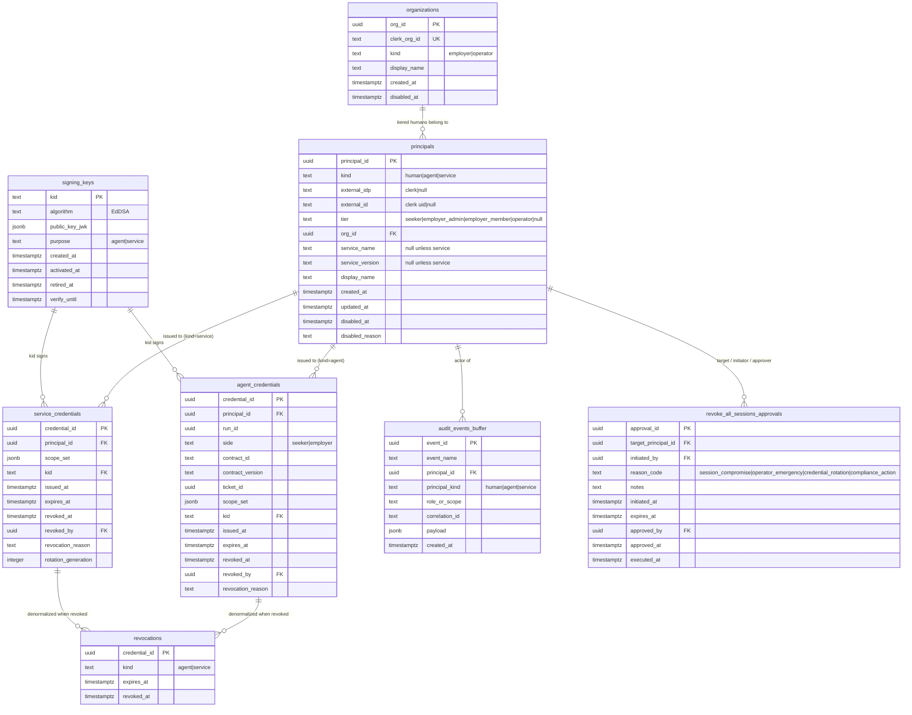

# Data Model — F03 governs the F02-shipped schema

**Spec:** v1.1 · **Plan:** v1.0 · **Date:** 2026-05-12

This document is the **canonical ER diagram** referenced by FR-7. It
describes the schema **F02 already shipped**; F03 does not change it.
This artifact is the version-controlled reference downstream features
(F04, F05, …) extend.

The full column-level register lives at
`docs/data-governance/data-classification.yaml` (authored during F03
implementation). This document is the structural overview.

---

## 1. Entity-relationship diagram

---

## 2. Table inventory

| Table | Shipped by | Source module | Migration | Primary class (F03 register) |
|---|---|---|---|---|
| `organizations` | F02 B2 | `packages/db/src/schema/organizations.ts` | `0000_f02_auth_principals_organizations.sql` | identity_principal |
| `principals` | F02 B2 | `packages/db/src/schema/principals.ts` | `0000_f02_auth_principals_organizations.sql` | identity_principal |
| `agent_credentials` | F02 B4 | `packages/db/src/schema/agent-credentials.ts` | `0001_f02_b4_agent_credentials_signing_keys_revocations.sql` | operational_credential |
| `signing_keys` | F02 B4 | `packages/db/src/schema/signing-keys.ts` | `0001_f02_b4_agent_credentials_signing_keys_revocations.sql` | operational_signing_key |
| `revocations` | F02 B4 | `packages/db/src/schema/revocations.ts` | `0001_f02_b4_agent_credentials_signing_keys_revocations.sql` | operational_credential |
| `service_credentials` | F02 B5.2 | `packages/db/src/schema/service-credentials.ts` | `0002_f02_b5_service_credentials.sql` | operational_credential |
| `audit_events_buffer` | F02 B6 | `packages/db/src/schema/audit-events-buffer.ts` | `0003_f02_b6_audit_events_buffer.sql` | audit_record |
| `revoke_all_sessions_approvals` | F02 B6 | `packages/db/src/schema/revoke-all-sessions-approvals.ts` | `0004_f02_b6_revoke_all_sessions_approvals.sql` | approval_workflow |

8 tables. The lint (R3) verifies every entry here appears in
`docs/data-governance/data-classification.yaml` and vice versa.

---

## 3. Key relationship semantics

- **`principals` is the spine.** Every actor — human, agent, service —
  has a row. Every audit event, credential, and approval references a
  principal.
- **`organizations` is mirror state of Clerk.** It is not the source
  of truth; Clerk is. The row exists to let policy gates branch on
  `kind ∈ {employer, operator}` without a Clerk round-trip.
- **`agent_credentials` and `service_credentials` are issuance
  records, not the tokens.** The token is the JWT held by the bearer.
  The row enables revocation, rate-limiting, and audit attribution.
- **`signing_keys` lifecycle** is `created → activated → retired →
  verify_until` (then dropped from JWKS). One active row per
  `purpose ∈ {agent, service}` enforced by partial unique index.
- **`revocations` is a denormalized hot path.** Verifier reads it
  with a 5-min TTL cache; rows older than `expires_at` are pruned by
  the Inngest daily job (F02 T048).
- **`audit_events_buffer` is transitional.** F05 replaces it with the
  hash-chained log; F03's retention policy declares the buffer's
  horizon as `transitional:f05` (CL-3).
- **`revoke_all_sessions_approvals` enforces the two-operator gate.**
  CHECK constraint forbids `approved_by = initiated_by`; reason_code
  is closed-set.

---

## 4. Index landscape (for context)

(Full list in `docs/data-governance/integrity-invariants.md` once
authored. This is the structural summary.)

- **Partial unique indexes** cap the active-state surface area:
  one active credential per (run, side, contract); one active key
  per purpose; one external_idp/external_id pair per non-null IdP.
- **Partial indexes on hot WHERE clauses:** `revoked_at IS NULL`
  active sets; `expires_at > now()` live sets; `disabled_at IS NULL`
  enabled sets.
- **Sort-key indexes** for newest-first listings: `created_at DESC`
  on `principals` and `audit_events_buffer`.

---

## 5. Out of scope for F03

- Ticket store tables (F04).
- Hash-chained audit log + tombstone storage (F05).
- Demographic data tables (F-TBD, gated on counsel review).
- Cross-region replica topology (F01-owned).
- Read-replica routing (Drizzle config; F01-owned).
