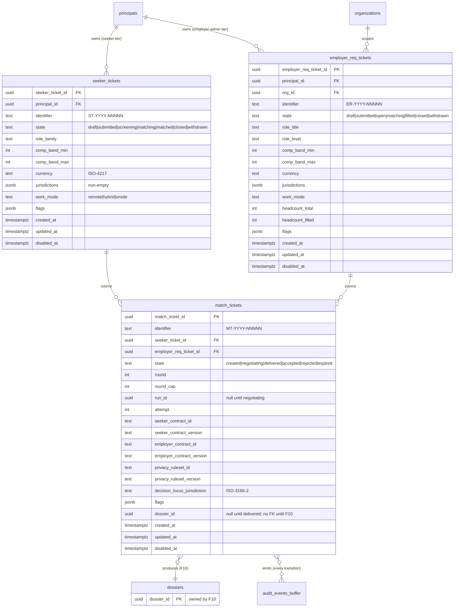
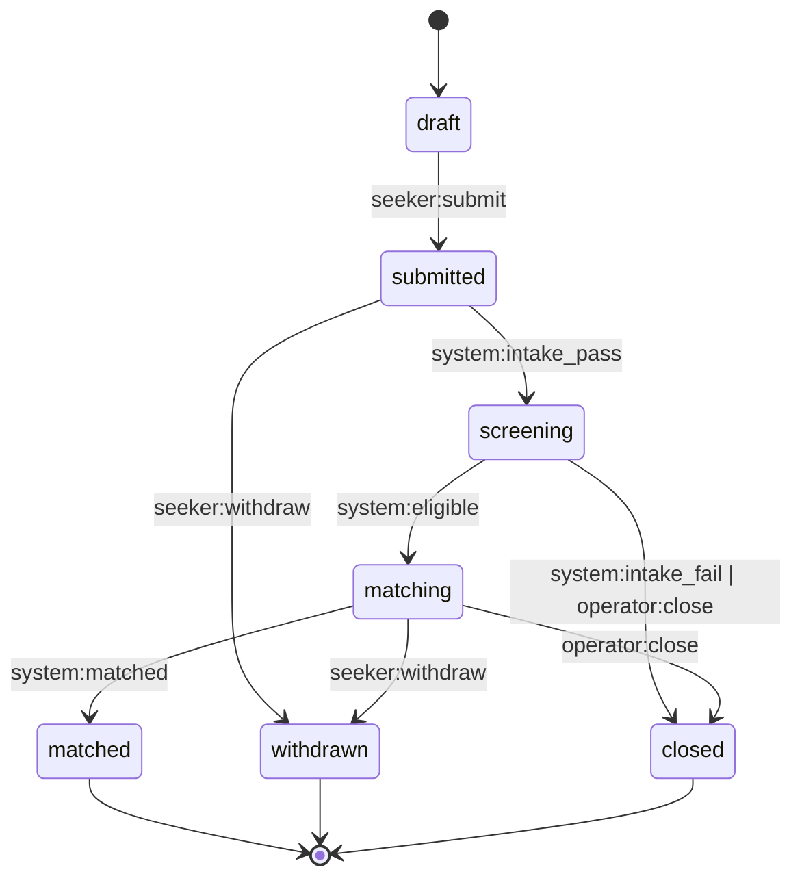
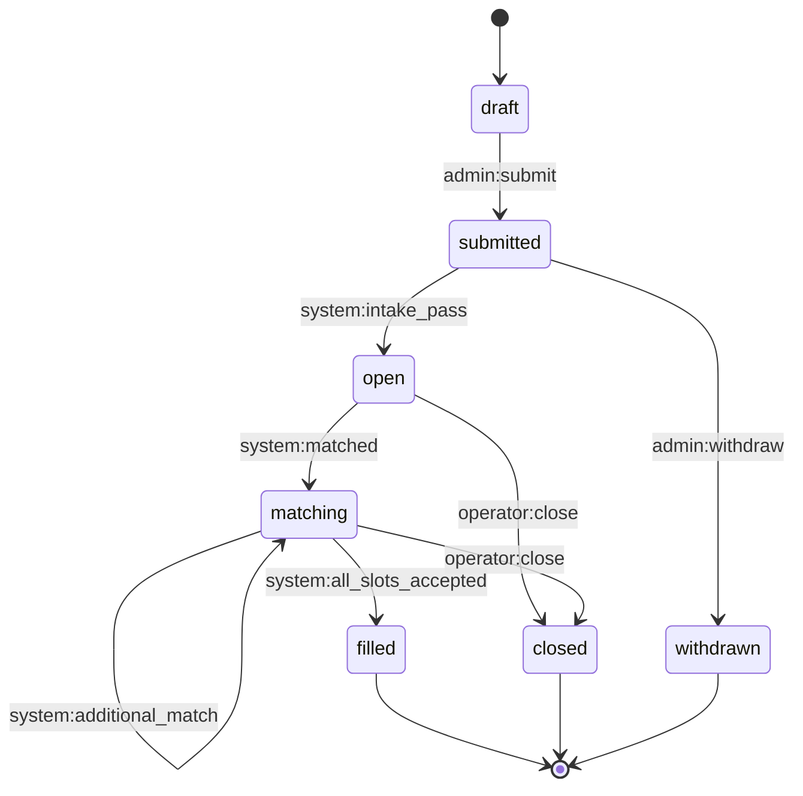
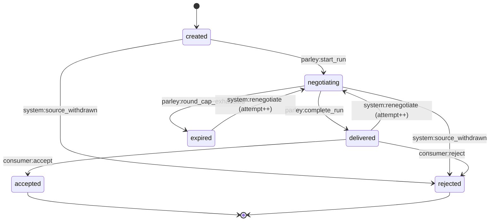

# Data Model — F04 Ticket Store

**Spec:** v1.1 · **Plan:** v1.0 · **Date:** 2026-05-12

The canonical ER diagram + the three state machines F04 introduces.
F03 conventions apply throughout; full per-column register entries
live in `docs/data-governance/data-classification.yaml` (extended by
F04's first migration commit).

---

## 1. Entity-relationship diagram

---

## 2. State machines

### 2.1 Seeker-ticket state machine

**Allowed transitions (FR-2.1):** 9 named edges. Terminal states:
`matched`, `closed`, `withdrawn`.

### 2.2 Employer-req state machine

**Allowed transitions (FR-2.2):** 9 named edges (including the
`matching → matching` self-loop for multi-headcount). Terminal states:
`filled`, `closed`, `withdrawn`.

### 2.3 Match-ticket state machine

**Allowed transitions (FR-2.3):** 9 named edges (including
re-negotiation re-entry per EC-7). Terminal states: `accepted`,
`rejected`.

---

## 3. Invariant summary

Per F03 §I.2 the invariants below are mandatory; full catalog entries
land in `docs/data-governance/integrity-invariants.md` at first commit.

### seeker_tickets
- `state` CHECK in seeker enum
- `comp_band_min <= comp_band_max`
- `jurisdictions` is a non-empty jsonb array of ISO-3166-2 strings
- `work_mode` CHECK in {`remote`,`hybrid`,`onsite`}
- `identifier` matches `ST-YYYY-NNNNN`, UNIQUE
- `currency` CHECK in ISO-4217 enum (subset; v0 list)
- FK `principal_id → principals.principal_id`

### employer_req_tickets
- `state` CHECK in employer-req enum
- `headcount_total >= 1`
- `headcount_filled` between 0 and `headcount_total`
- `comp_band_min <= comp_band_max`
- `identifier` matches `ER-YYYY-NNNNN`, UNIQUE
- FK `principal_id → principals.principal_id`
- FK `org_id → organizations.org_id`
- `role_level` CHECK in level enum

### match_tickets
- `state` CHECK in match enum
- `0 <= round <= round_cap`
- `round_cap >= 1`
- `attempt >= 1`
- `identifier` matches `MT-YYYY-NNNNN`, UNIQUE
- `decision_locus_jurisdiction` ISO-3166-2
- UNIQUE `(seeker_ticket_id, employer_req_ticket_id, attempt)` —
  idempotency (FR-8)
- `run_id IS NOT NULL` when `state ∈ ('negotiating','delivered','accepted','rejected','expired')`
- `dossier_id IS NOT NULL` when `state ∈ ('delivered','accepted','rejected')`
- FK `seeker_ticket_id → seeker_tickets`
- FK `employer_req_ticket_id → employer_req_tickets`
- **No FK** `dossier_id → dossiers` (CL-2 — added by F10)

### Indexes

- Each kind: `(state) WHERE state IN ('matching','negotiating')` partial
- Each kind: `(identifier)` UNIQUE
- Each kind: `(created_at DESC)` for newest-first listings
- `match_tickets (seeker_ticket_id)` and `(employer_req_ticket_id)`
- `match_tickets (run_id) WHERE run_id IS NOT NULL`
- `match_tickets (decision_locus_jurisdiction)` for F06 joins

---

## 4. Class assignments (extends F03 register)

Two new data classes are introduced:

### `ticket_intent` (new)
- **Sensitivity:** high
- **Erasure mode:** tombstone
- **Default lawful basis:** GDPR Art. 6(1)(b) performance of contract
  (Spyglass matching service)
- **Covers:** seeker_tickets, employer_req_tickets — all personal-data
  columns; structural columns (state, kind enums) erase as `hard_delete`.

### `ticket_match` (new)
- **Sensitivity:** high
- **Erasure mode:** tombstone
- **Default lawful basis:** GDPR Art. 6(1)(b) performance of contract;
  audit retention obligation under §I.5.3 keeps row metadata.
- **Covers:** match_tickets — all columns linking back to seeker or
  employer principals tombstone-mode; structural columns
  (state, round, attempt, contract refs) erase as `hard_delete`.

Retention horizons (added to `docs/data-governance/retention-policy.md`):
- `ticket_intent`: 7 years after `disabled_at`; rationale = employer
  audit retention floor (NYC LL 144 §5-301) + GDPR Art. 5(1)(e).
- `ticket_match`: 7 years after terminal-state entry; same rationale.

---

## 5. Relationship to existing F02 + F03 entities

- `seeker_tickets.principal_id` joins to F02's `principals` (kind = 'human', tier = 'seeker').
- `employer_req_tickets.principal_id` joins to a `kind='human', tier IN ('employer_admin', 'employer_member')` principal.
- `employer_req_tickets.org_id` joins to F02's `organizations` (kind='employer').
- `match_tickets` emits transition events into F02's `audit_events_buffer`.
- All F04 tables follow F03 conventions and appear in the register before any F04 code lands.

---

## 6. Out of scope (F04 will NOT create)

- `dossiers` table (F10)
- `audit_log` hash-chained replacement of `audit_events_buffer` (F05)
- `transcript_store` (F05)
- `jurisdiction_policies` and policy-gate rows (F06)
- `privacy_filter_rulesets` (F09)
- `agent_contracts` registry (F07a)
- `scoring_rubrics` (F07b)

F04 references these via text columns (`*_contract_id`,
`*_ruleset_id`) until each owner-feature lands its tables and adds
the FK constraints in its own migration.
